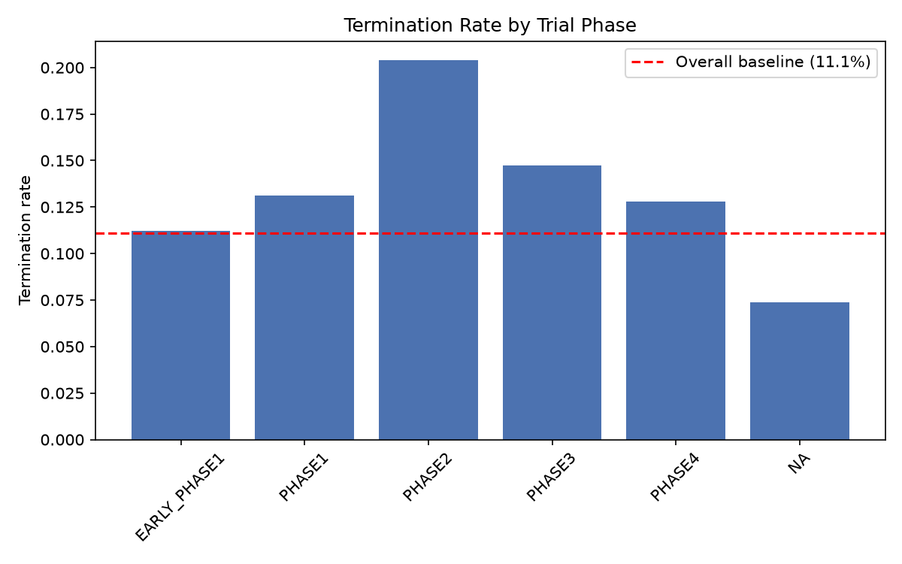
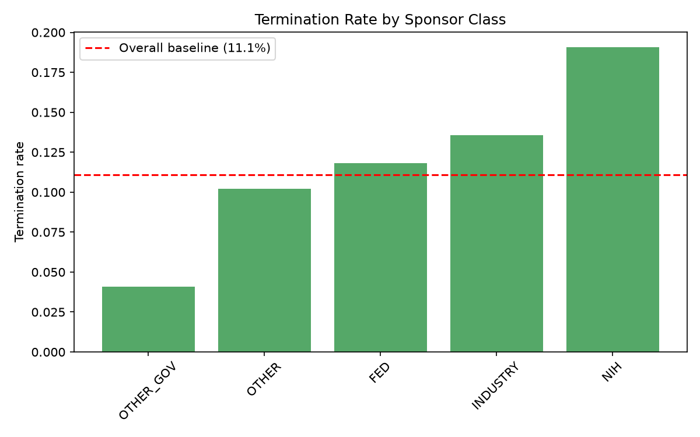
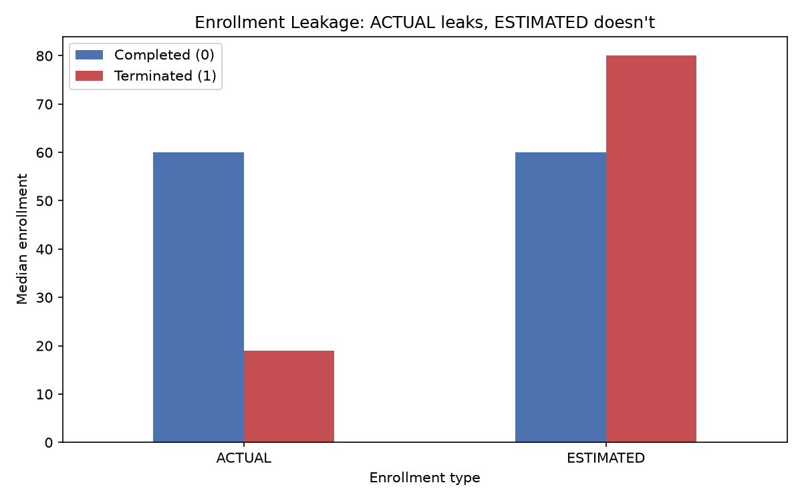

# Clinical Trial Termination Prediction

Predicting which registered clinical trials will terminate early, using only information
knowable at registration — trained on 15K+ interventional trials from the ClinicalTrials.gov API.

**[▶ Live interactive demo](https://clinical-trial-termination-nzq.streamlit.app/)**

Data snapshot: 2026-09-06

---

## The problem

Clinical trials fail. When a trial terminates early, the sponsor loses the investment and
patients are exposed to risk with no benefit to medical knowledge. A model that flags
high-termination-risk trials *at registration* could help sponsors reconsider trial design
before committing resources.

This project predicts early termination from registration-time features alone, with careful
attention to the label-leakage traps that make this problem look easier than it is.

---

## Data

- **Source:** [ClinicalTrials.gov API v2](https://clinicaltrials.gov/api/v2/studies) — public, no key.
- **Pull:** 30,000 completed-or-terminated trials, cursor-paginated.
- **Cleaning:** flattened deeply nested JSON into a flat table; recovered ~11,000 records
  initially lost to a date-parsing bug (year-month-only dates like `2013-01` that the parser
  silently dropped).
- **Filters:** interventional trials only, started 2010–2022 (old enough to have resolved),
  with usable eligibility text.
- **Final dataset:** 15,461 trials, **11.1% terminated** (an imbalanced target).

| Filter | Rows dropped |
|---|---|
| Non-interventional | 6,227 |
| Unparseable start date | 175 |
| Outside 2010–2022 window | 8,132 |
| Missing/short eligibility text | 5 |

---

## Label leakage - the core of the project

Several fields are only populated *because* a trial terminated, so using them gives an
unrealistically high AUC and a worthless model. The rule: **a feature is legitimate only if
its value was knowable on the day the trial was registered.**

The central trap was **enrollment**. In EDA, terminated trials showed a median enrollment of
19 vs. 60 for completed trials — a huge gap. But this is a *consequence* of termination, not a
predictor: a trial that terminates enrolls few patients *because it stopped*.

Splitting by `enrollment_type` made this precise:

| enrollment_type | Completed (median) | Terminated (median) |
|---|---|---|
| ACTUAL | 60 | **19** ← leaks |
| ESTIMATED | 60 | **80** ← no leak |

*Actual* enrollment leaks; *estimated* (the target set at registration) does not. But 98.5% of
records had only the leaky ACTUAL value, so rather than restrict to the 227 clean records,
**I dropped enrollment entirely**, removing the leakage while keeping the full sample.

I also excluded `whyStopped`, completion dates, results-posting flags, and status itself, all
of which encode the outcome.

---

## Modeling

- **Split:** temporal — train on trials started before 2018, test on 2018+ (predicting the
  future, not interpolating). Validated by EDA showing termination rate is stable across years.
- **Imbalance:** class-balanced weighting (11% positive class).
- **Models:** a logistic-regression baseline and a histogram gradient-boosting classifier.

| Model | ROC-AUC | PR-AUC |
|---|---|---|
| Logistic regression | 0.710 | 0.243 |
| Gradient boosting | 0.707 | 0.245 |

**Results are honest, not inflated.** A realistic ~0.71 ROC-AUC (not a suspicious 0.95)
indicates the leakage was successfully removed. PR-AUC of ~0.25 against an 11% base rate is
roughly 2× better than random — meaningful signal on a genuinely hard problem.

The two models tied, which suggests the predictive signal is largely **linear** — the tree
model's ability to capture interactions bought little here, so the simpler, interpretable model
is an equally valid choice.

---

## What predicts termination

Confirmed via permutation importance (which also served as a second, empirical leakage check —
the top features are all registration-time-legitimate):

1. **Eligibility criteria length** — a proxy for enrollment restrictiveness. More elaborate
   eligibility rules mean fewer eligible patients, raising the risk of insufficient accrual.
2. **Whether healthy volunteers are accepted.**
3. **Oncology** as a condition area — consistent with the known difficulty of completing cancer trials.

Note: sponsor class and phase showed strong *marginal* effects in EDA but contributed more
modestly in the full model, likely because their signal overlaps with other features. These are
associations, not proven causes.

---

## Threshold choice

The probability scores were turned into decisions with a threshold tuned to a stated use case —
*flagging trials for review*, where missing a termination (false negative) is costlier than an
unnecessary review (false positive). Sweeping thresholds:

| Threshold | Recall | Precision | Terminations caught |
|---|---|---|---|
| 0.35 | 0.81 | 0.16 | 579 / 714 |
| **0.40** | **0.73** | **0.18** | **522 / 714** |
| 0.50 | 0.58 | 0.21 | 413 / 714 |
| 0.60 | 0.33 | 0.27 | 236 / 714 |

I chose **0.40**, catching 73% of terminations at a workable false-alarm rate. Precision is
inherently limited by the 11% base rate — the goal was a sensible recall/precision balance for
review-flagging, not high precision.

---

## Figures







---

## What I'd tell a sponsor

Trials with highly restrictive eligibility criteria and oncology trials carry elevated
termination risk. Where scientifically appropriate, broadening eligibility to ease enrollment
may reduce the risk of termination for insufficient accrual.

---

## Repo structure

```
clinical-trial-termination/
├── src/
│   ├── fetch.py       # ClinicalTrials.gov API pull + pagination
│   ├── clean.py       # flatten nested JSON, filter, build target
│   ├── features.py    # leakage-free feature engineering
│   └── model.py       # temporal split, train, save model
├── notebooks/
│   ├── 01_eda.ipynb   # exploratory analysis + leakage discovery
│   └── figures/       # plots used in this README
├── app/
│   ├── streamlit_app.py
│   ├── model.joblib
│   └── feature_names.joblib
└── requirements.txt
```

## How to run

```bash
python3 -m venv venv && source venv/bin/activate
pip install -r requirements.txt
python src/fetch.py       # pull raw data
python src/clean.py       # -> data/processed/trials.parquet
python src/features.py    # -> features + target
python src/model.py       # train + save model
streamlit run app/streamlit_app.py   # run the app locally
```

---

## Limitations

- Registry data is self-reported and inconsistent; some fields are missing or malformed.
- The dataset is a convenience sample (first 30K matching trials in the API's default order,
  then filtered), not a random sample — noted for reproducibility.
- Feature importance reflects *association*, not causation.
- Performance is modest by construction: early termination is hard to predict from
  registration-time information alone, and honest evaluation reflects that.